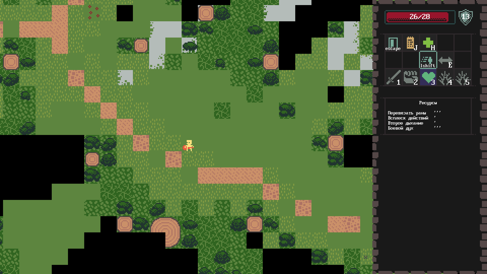

# DOT



Приключение/мини-РПГ с пошаговой боёвкой и видом сверху.

## Установка

### Windows

1. Скачать win64 версию из [последнего релиза](https://github.com/girvel/dot/releases/latest)
2. Распаковать
3. Запустить dot.exe

### Linux

1. Установить [love](https://love2d.org)
2. Скачать linux версию из [последнего релиза](https://github.com/girvel/dot/releases/latest)
3. Распаковать
4. `love dot.love`

## Разработка

Запустить игру:

```bash
love .
```

Запустить тесты:

```bash
busted
```

Собрать игру:

```bash
./engine/build
```
